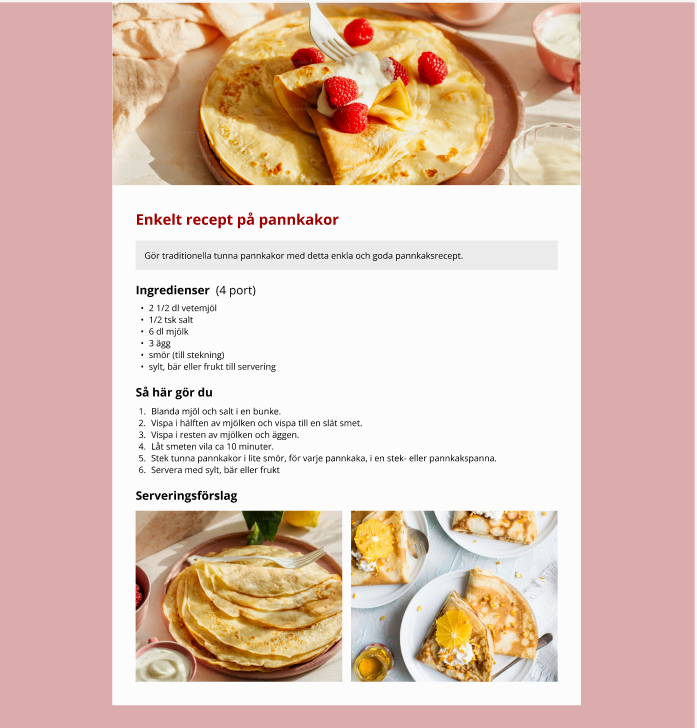

# 🥞 Simple Pancake Recipe Website

This is a static recipe webpage built using **HTML and CSS**, based on a provided **Figma design**. The project showcases a classic Swedish pancake recipe with styled ingredients, instructions, and images – all laid out to match the original design as closely as possible.

> ✅ **This project was created as part of my application for a Frontend Web Development Bootcamp.**  
> It demonstrates my ability to interpret a design and translate it into HTML and styled CSS, after just two weeks of learning frontend development.

---

## 🎯 Design vs Implementation

| Figma Design | Final Website |
|--------------|---------------|
|  |  |

## 🧰 Technologies Used

- **HTML5** – structure and clean layout  
- **CSS3** – custom styling, flexbox layout, `object-fit`, and positioning  
- **Figma** – used as a reference for layout, spacing, and typography  

## 🔍 Features

- Fully structured recipe page with headings, ingredients, and instructions  
- Styled layout matching the original design mockup  
- Responsive image layout using **Flexbox** and `gap`  
- Image scaling with `object-fit: cover` for consistent visuals  
- Color and typography customization from the design

## 🧪 Work in Progress & Branches

This project is part of my learning journey in frontend development.

So far, I've created a new branch focused on improving **semantic HTML**:

🔀 **Branch: `semantic_html`**  
Includes improved use of semantic tags such as `<main>`, `<section>`, `<article>`, and better overall structure to enhance accessibility and readability.

More improvements will be added in future branches as I continue learning and practicing!